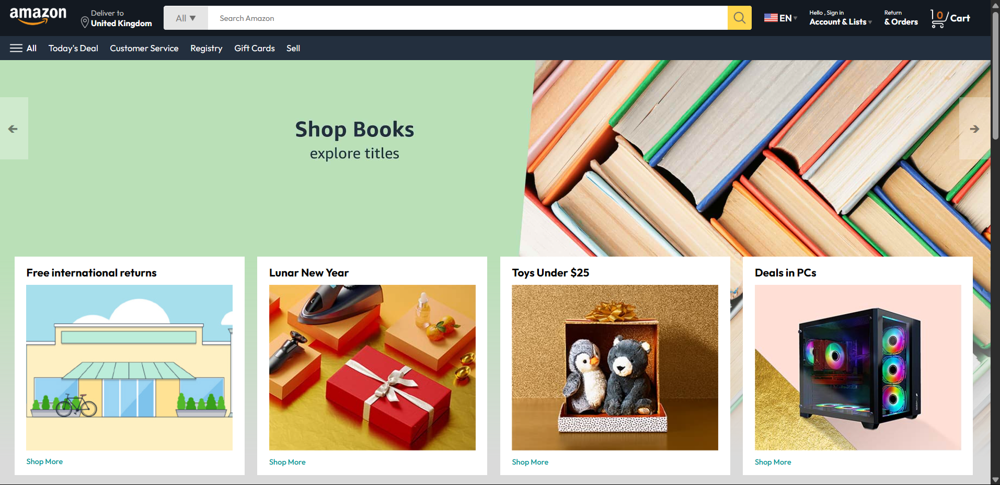
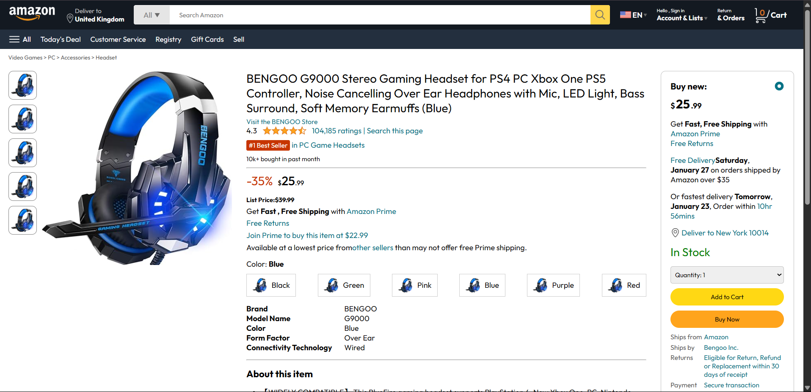
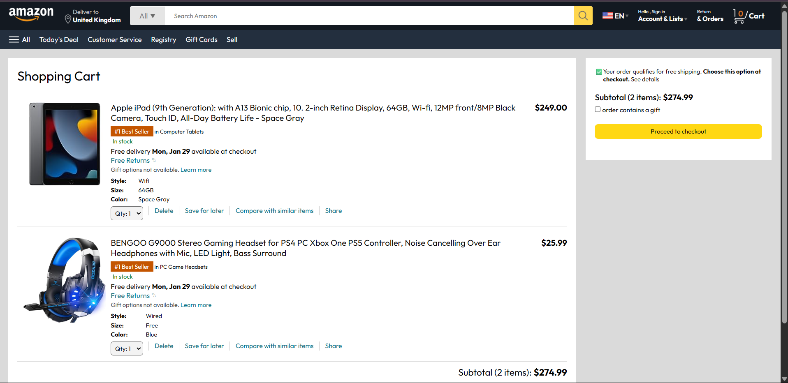
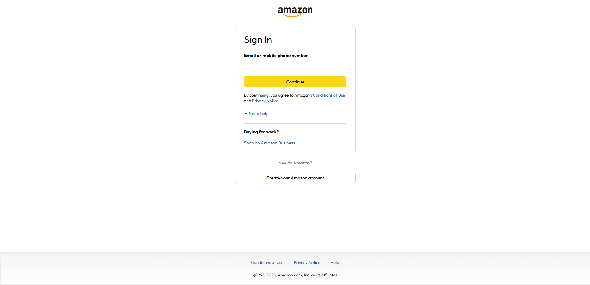

# 🛒 Amazon Clone - My First Frontend Project

> 💻 Built with 💖 using **HTML**, **CSS**, and **JavaScript**  
> 🔥 Fully responsive | 📦 Product Page | 🛍️ Cart Page | 🔐 Sign In & Sign Up  
> 🌱 *“This is where my frontend journey truly began...”*

---

## 🚀 Live Preview

🔗 [Click here to view the live site](#)

---

## 📸 Screenshots

| Landing Page | Product Page | Cart Page | Auth Pages |
|--------------|--------------|-----------|------------|
|  |  |  |  |

---

## 🧠 About the Project

This is my **first frontend clone project** and I chose **Amazon** because:
- It has a clean yet complex UI
- It challenges HTML + CSS layouting skills
- It includes real-world features like **cart**, **login/signup**, **product listing**, etc.

What started as a curiosity… became my passion 💛  
Every `div`, every `box-shadow`, every `eventListener` is a milestone in my learning journey.

---

## ✨ Features

✅ Beautiful **Landing Page** (Just like Amazon!)  
✅ **Product Listing Page** with neat styling  
✅ **Add to Cart** functionality with JavaScript  
✅ **Sign In / Sign Up** forms (frontend only)  
✅ **Responsive Design** for mobile + desktop  
✅ Neat, clean folder structure and reusable code blocks  

---

## 🧱 Tech Stack

- `HTML5` – for building the structure  
- `CSS3` – for styling, responsiveness and layouting  
- `Vanilla JavaScript` – for DOM, cart logic, interactivity  

---

## 📂 Folder Structure
amazon-clone/
│
├── index.html # Landing page
├── products.html # Product listing
├── cart.html # Cart page
├── signin.html # Sign-in form
├── signup.html # Sign-up form
│
├── css/
│ └── style.css # All styles
│
├── js/
│ └── script.js # All JS logic
│
├── assets/
│ └── images/ # Product & UI images
│
└── README.md # You’re reading it 😉

---

## 💡 What I Learned

✨ HTML Semantics  
✨ CSS Flexbox, Grid, Media Queries  
✨ JS DOM Manipulation  
✨ LocalStorage logic (for cart)  
✨ How to think like a frontend engineer 👨‍💻

> **Biggest lesson**: "Code toh ban jaata hai, lekin jab tak dil se nahi likhte, wo real frontend feel nahi aata."

---

## 🧠 Future Enhancements

- ✅ Add real authentication with Firebase or backend
- ✅ Improve cart logic with quantities
- ✅ Add payment integration (just for demo)
- ✅ Deploy it with custom domain

---

## 📢 Feedback is Love ❤️

If you saw this and smiled — yaad rakhna:  
Main abhi seekh raha hoon.  
Feel free to open issues, suggest improvements, ya sirf "Nice work!" keh do.  
**Every word means a lot to me.** 🙏

---

## 📬 Connect with Me

🔗 [LinkedIn](#) *(add your link)*  
🐙 [GitHub](#) *(add your link)*  
📩 Let’s build something together!

---

## 🌟 Final Words

> “Yeh sirf Amazon Clone nahi, yeh meri mehnat, meri dedication, meri Zoya wali journey ka pehla kadam hai.”  
> 💪 *Ab yeh sirf start hai... Rukunga nahi.*

---

